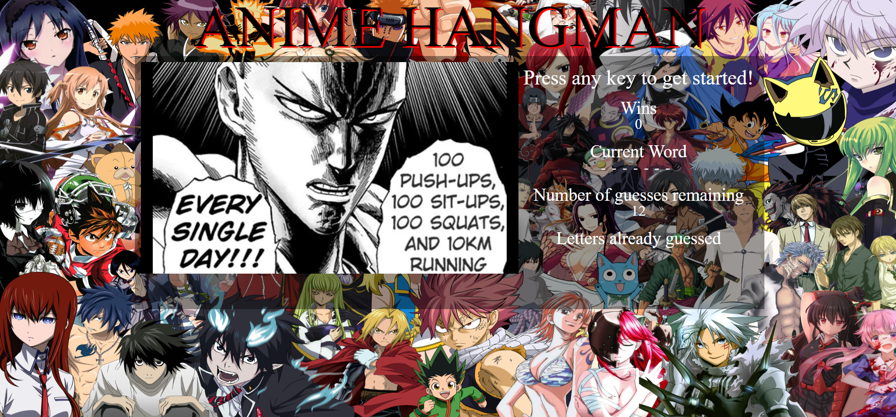

# Word-Guess-Game

A website to play hangman, anime style. Upon any key press a song plays in the background on loop. Wins updates the users score everytime they guess a word correctly. The current word being guessed has all characters set as -'s and any correct guesses replace the -'s with the corresponding letter(s). Every round the user has twelve guesses and if they run out they lose that round, but loses are not tracked. Regardless of if a user wins or loses an appropriate image pops up on the left side of the site either informing them of the lose or displaying the word that was guessed correctly. Only a-z keys are accepted as input and are tracked under "Letters already guessed".

# Link to Deployed Site
- [Word-Guess-Game](https://jakedudum.github.io/Word-Guess-Game/)

# Built With
- [HTML](https://developer.mozilla.org/en-US/docs/Learn/HTML)
- [CSS](https://developer.mozilla.org/en-US/docs/Web/CSS)
- [Javascript](https://developer.mozilla.org/en-US/docs/Web/JavaScript)

# Versioning
- [Github](https://github.com/)

# Authors
### Jake Dudum